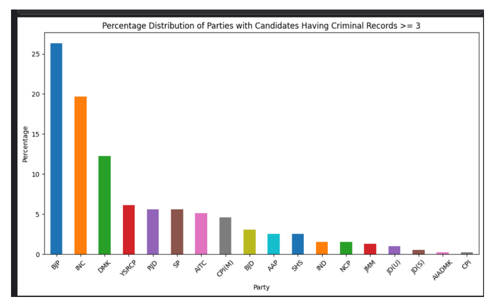
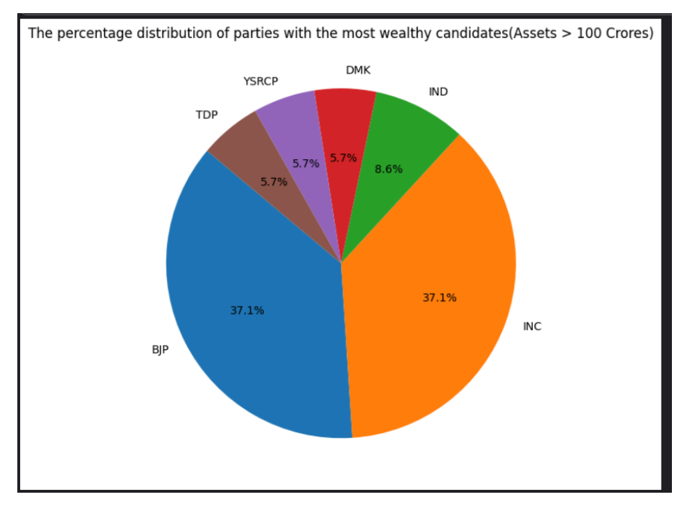

# Python Assignment: Predicting Education Level of Party Candidates

## Introduction

This project implements a machine learning model to predict the education level of party candidates based on features such as Party, Criminal Cases, State, Liabilities, and more.

## Libraries Used
- NumPy
- Pandas
- Matplotlib
- Scikit-learn (specifically, the `RandomForestClassifier` from the `ensemble` module)

## Pre-Processing Data

Before training the machine learning model, the data undergoes preprocessing steps:

- **Label Encoding**: Categorical variables in the dataset are encoded using the `LabelEncoder` from scikit-learn. This is done for both the target variable (Education) and the features (Party, Criminal Case, State).

## Model Selection and Training

The project involves tuning a `RandomForestClassifier` using cross-validation. Here's a brief description of the process:

1. **Train-Test Split**: The dataset is split into training and validation sets using `train_test_split`. This allows training the model on one subset of the data and evaluating its performance on another.
2. **Evaluation Function**: A function called `get_mae` is defined, which takes the maximum number of leaf nodes (`max_leaf_nodes`) as a parameter. Inside this function, a `RandomForestClassifier` model is trained with the specified `max_leaf_nodes` to compute the mean absolute error (MAE) between the actual and predicted values on the validation set.

Note: The final submission does not use `max_leaf_nodes` due to decreased performance with this parameter.

## Plots

1. **Percentage distribution of parties with candidates having the most criminal records**:
   
    

2. **Percentage distribution of parties with the most wealthy candidates**:
   
    

## Results

- **Public F1 score**: 0.24282
- **Private F1 score**: 0.21466

## References

- Kaggle Tutorial given in Discussion section.
